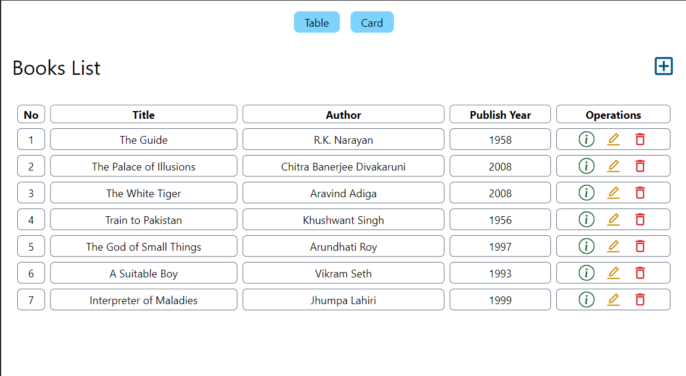
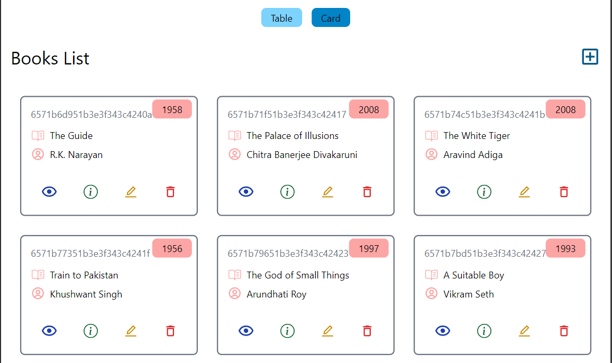
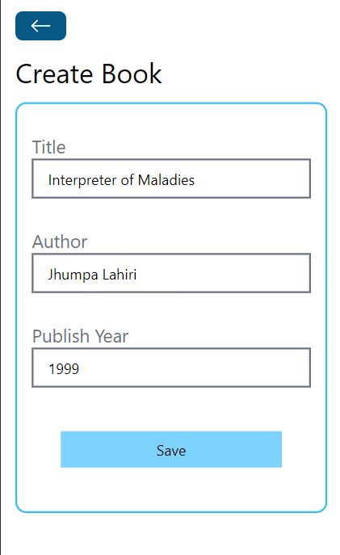
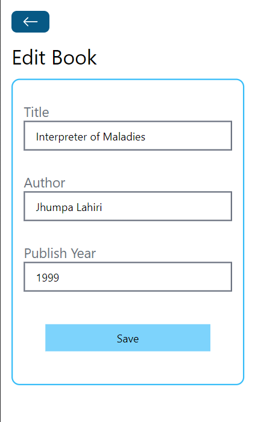
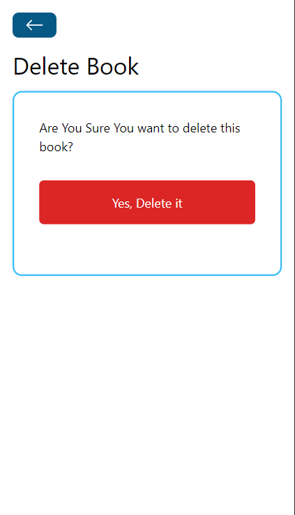

# Book Store - MERN Stack CRUD Application

Book Store is a full-stack web application built using the MERN (MongoDB, Express.js, React.js, Node.js) stack.This project is a simple CRUD (Create, Read, Update, Delete) application developed using the MERN (MongoDB, Express.js, React, Node.js) stack. It allows users to add, view, update, and delete book details such as title, author, and publish year.

## Deployment

Visit the live deployment at [Book Store on Vercel](https://book-store-anirudh-kille.vercel.app/).

## Features

- **Create:** Add new books with details like title, author, and publish year.
- **Read:** View the list of books with their details.
- **Update:** Modify existing book details.
- **Delete:** Remove books from the store.

## Tech Stack

**Client:** React, TailwindCSS

**Server:** Node, Express, Axios

**Database:** MongoDB

## Screenshots

## Home Page

    
    &ensp; &ensp;

    
    &ensp; &ensp;

## Create Page

    
    &ensp; &ensp;

## Edit Page

    
    &ensp; &ensp;

## Delete Page

    
    &ensp; &ensp;

